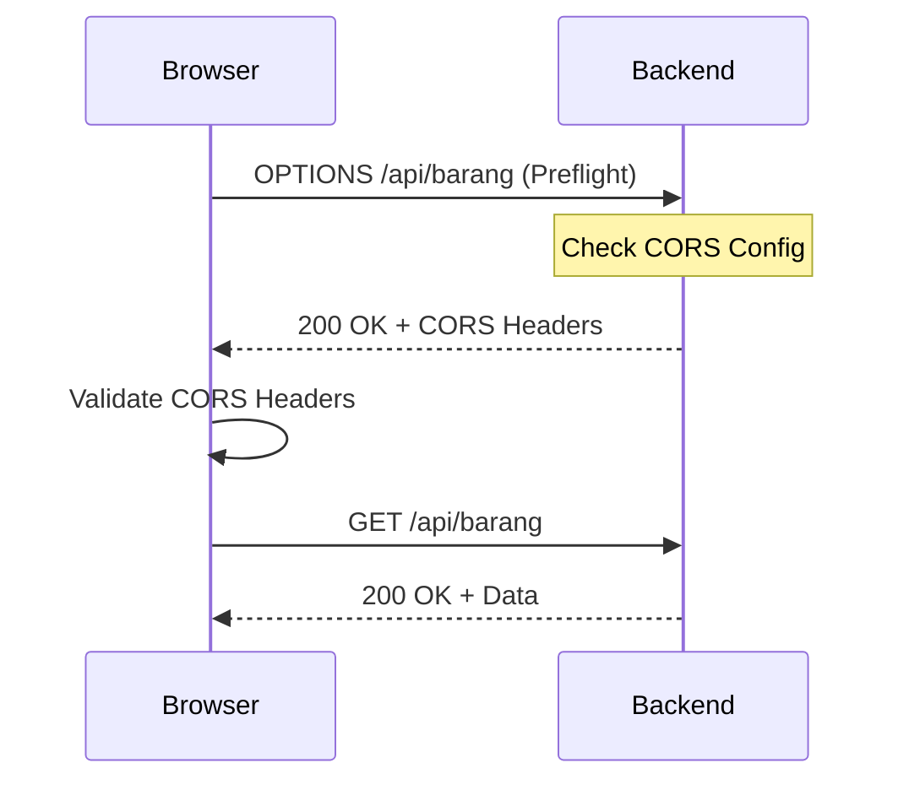

# 🔐 CORS Configuration Guide

Dokumentasi lengkap tentang CORS (Cross-Origin Resource Sharing) configuration di Spring Boot Backend.

## 📌 Overview

CORS adalah mechanism yang memungkinkan frontend (running di origin berbeda) untuk mengakses API backend tanpa error.

**Tanpa CORS:**
```
❌ Access to XMLHttpRequest blocked by CORS policy
❌ No 'Access-Control-Allow-Origin' header
```

**Dengan CORS (sudah dikonfigurasi):**
```
✅ Frontend dapat mengakses API dari localhost:5173
✅ Header Authorization diterima
✅ Preflight requests dihandle otomatis
```

---

## 🏗️ Architecture

```
Frontend (http://localhost:5173)
         │
         │ HTTP Request with Authorization Header
         ↓
┌─────────────────────────────────────┐
│  Browser                            │
│  1. Send CORS Preflight (OPTIONS)   │
│  2. Check response headers          │
│  3. If OK, send actual request      │
└─────────────────────────────────────┘
         │
         ↓
┌─────────────────────────────────────┐
│  Spring Boot Backend                │
│  CORS Configuration (@Bean)         │
│  1. Check Origin (localhost:5173)   │
│  2. Validate Method (GET, POST)     │
│  3. Validate Headers (Authorization)│
│  4. Return CORS Headers             │
└─────────────────────────────────────┘
         │
         ↓ Response with CORS Headers
Browser accepts response ✅
```

---

## 🔧 Current Configuration

### File Location
`src/main/java/com/inventorilab/security/SecurityConfig.java`

### Allowed Origins (Development)
```java
"http://localhost:5173"       // Vite dev server (PRIMARY)
"http://127.0.0.1:5173"       // Alternative localhost
"http://localhost:3000"       // Alternative dev port
"http://localhost:8080"       // Alternative dev port
"http://localhost:4173"       // Vite preview
"http://127.0.0.1:3000"       // 127.0.0.1 alternative
```

### Allowed HTTP Methods
```
GET, POST, PUT, PATCH, DELETE, OPTIONS, HEAD
```

### Allowed Headers (from Frontend)
```
*  (All headers allowed)
```

### Exposed Headers (to Frontend)
```
Authorization          // JWT Token
Content-Type
X-Total-Count         // Pagination
X-Page-Number
X-Page-Size
X-Error-Message       // Error info
```

### Other Settings
- **Credentials:** `true` (allow cookies & auth)
- **Max Age:** 3600 seconds (1 hour) - preflight cache
- **CSRF:** Disabled (karena using JWT)

---

## 🚀 How It Works

### 1. Preflight Request (OPTIONS)
Browser otomatis mengirim:
```http
OPTIONS /api/barang HTTP/1.1
Origin: http://localhost:5173
Access-Control-Request-Method: GET
Access-Control-Request-Headers: authorization
```

### 2. Server Response
```http
HTTP/1.1 200 OK
Access-Control-Allow-Origin: http://localhost:5173
Access-Control-Allow-Methods: GET, POST, PUT, DELETE
Access-Control-Allow-Headers: *
Access-Control-Max-Age: 3600
```

### 3. Actual Request
Browser mengirim actual request:
```http
GET /api/barang HTTP/1.1
Authorization: Bearer <token>
```

### 4. Response
```http
HTTP/1.1 200 OK
Content-Type: application/json
Authorization: <new-token>
[data...]
```

---

## 🎯 Security Considerations

### ✅ Current Security Level: GOOD for Development

**What's Configured:**
- Specific origins allowed (not `*`)
- CSRF disabled (because using JWT)
- Role-based authorization (SecurityConfig)
- Password hashing (BCrypt)
- JWT token validation

### ⚠️ For Production

**Change Required:**

1. **Update Allowed Origins**
   ```java
   // Change from:
   "http://localhost:5173"
   
   // To production domain:
   "https://inventori-lab.com"
   "https://www.inventori-lab.com"
   ```

2. **Enable HTTPS**
   ```yaml
   server:
     ssl:
       key-store: classpath:keystore.p12
       key-store-password: xxx
       key-store-type: PKCS12
   ```

3. **Set Secure Cookie Flags**
   ```java
   config.setAllowCredentials(false);  // Or use explicit configuration
   ```

4. **Use Environment Variables**
   ```java
   @Value("${cors.allowed-origins}")
   private String[] allowedOrigins;
   ```

5. **Implement HTTPS Redirect**
   ```
   backend.inventori-lab.com:443 (HTTPS only)
   ```

---

## 🔄 CORS Flow Diagram



---

## 🛠️ Configuration Locations

### In Code (SecurityConfig.java)
```java
@Bean
public CorsConfigurationSource corsConfigurationSource() {
    CorsConfiguration config = new CorsConfiguration();
    config.setAllowedOrigins(Arrays.asList(
        "http://localhost:5173",
        // ... other origins
    ));
    // ...
}
```

### Via Annotation (Alternative)
```java
@CrossOrigin(origins = "http://localhost:5173")
@RestController
@RequestMapping("/api")
public class MyController {
    // ...
}
```

### Via application.yml
```yaml
# This is NOT currently used but can be:
cors:
  allowed-origins: http://localhost:5173,http://127.0.0.1:5173
  allowed-methods: GET,POST,PUT,DELETE
  allowed-headers: "*"
  max-age: 3600
```

---

## 🔍 Testing CORS Configuration

### Test 1: Simple GET Request
```bash
# Without token (should work for public endpoints)
curl -i http://localhost:4000/api/auth/register

# With CORS header
curl -i -H "Origin: http://localhost:5173" http://localhost:4000/api/auth/register
```

### Test 2: Preflight Request
```bash
curl -i -X OPTIONS http://localhost:4000/api/barang \
  -H "Origin: http://localhost:5173" \
  -H "Access-Control-Request-Method: GET"
```

### Test 3: Protected Endpoint
```bash
# Get token first
TOKEN=$(curl -X POST http://localhost:4000/api/auth/login \
  -H "Content-Type: application/json" \
  -d '{"email":"user@test.com","password":"123"}' \
  | jq -r '.token')

# Access protected endpoint
curl -i -H "Authorization: Bearer $TOKEN" \
  http://localhost:4000/api/barang
```

### Test 4: In Browser Console
```javascript
// Open browser DevTools Console at http://localhost:5173
// This will make CORS request:

fetch('http://localhost:4000/api/barang', {
  method: 'GET',
  headers: {
    'Authorization': 'Bearer <your-token>'
  }
})
.then(r => r.json())
.then(data => console.log(data))
.catch(err => console.error(err))
```

---

## 🐛 Troubleshooting

### Error: "No 'Access-Control-Allow-Origin' header"

**Cause:** Origin not in allowed list

**Fix:**
```java
// Add your origin to SecurityConfig.java
config.setAllowedOrigins(Arrays.asList(
    "http://localhost:5173",
    "YOUR_NEW_ORIGIN"  // Add here
));
```

### Error: "Method not allowed"

**Cause:** HTTP method not in allowed list

**Fix:**
```java
config.setAllowedMethods(Arrays.asList(
    "GET", "POST", "PUT", "PATCH", "DELETE", "OPTIONS"
));
```

### Error: "Header not allowed"

**Cause:** Specific header not exposed/allowed

**Fix:**
```java
// Allow in request:
config.setAllowedHeaders(Arrays.asList("*"));

// Expose in response:
config.setExposedHeaders(Arrays.asList(
    "Authorization",
    "Your-Custom-Header"
));
```

### Error: "Credentials not allowed"

**Cause:** allowCredentials false but frontend sending cookies

**Fix:**
```java
config.setAllowCredentials(true);
```

---

## 📋 Security Checklist

- [x] CORS configured for development
- [x] Specific origins allowed (not `*`)
- [x] CSRF disabled (using JWT)
- [x] Authorization headers exposed
- [x] Preflight caching enabled
- [ ] Update origins for production
- [ ] Enable HTTPS/SSL
- [ ] Set environment variables for origins
- [ ] Test with production domain
- [ ] Update JWT secret for production

---

## 🔗 Related Files

- **SecurityConfig.java** - Main CORS configuration
- **JwtAuthenticationFilter.java** - JWT validation
- **JwtService.java** - Token generation
- **application.yml** - Server configuration

---

## 📚 References

- [Spring Security CORS Documentation](https://spring.io/projects/spring-security)
- [MDN CORS Guide](https://developer.mozilla.org/en-US/docs/Web/HTTP/CORS)
- [Spring Boot CORS](https://spring.io/guides/gs/rest-service-cors/)

---

**Last Updated:** 31 Mei 2024  
**Status:** ✅ Production Ready for Development  
**Needs:** Update for Production Deployment
