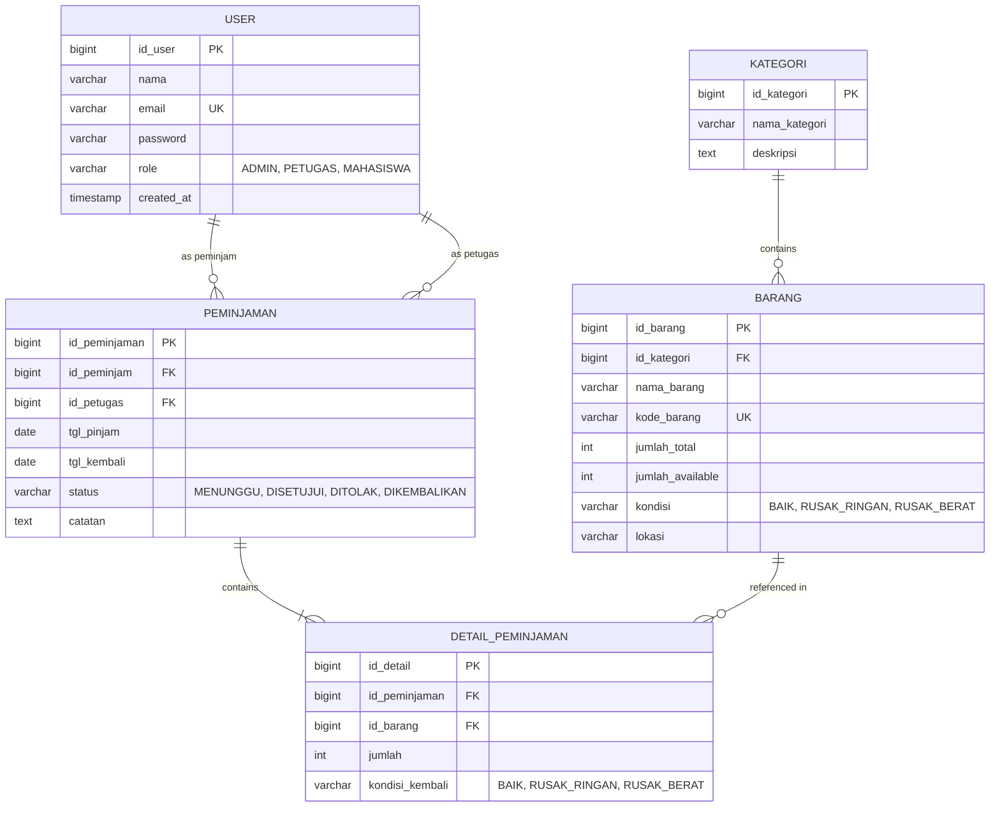

# Implementation Plan - Sistem Pendataan Inventaris Laboratorium REST API

This document describes the plan to build a complete Spring Boot REST API for a **Laboratory Inventory Data System** (Sistem Pendataan Inventaris Laboratorium) with JWT authentication, role-based access control, transaction management, and standard response formats.

## User Review Required

> [!IMPORTANT]
> The database connection details will be configured in `src/main/resources/application.yml` targeting local MySQL database `db_inventori_lab`. Please ensure you have a running MySQL instance or we can provide a script to easily run one if needed.
> The application will include a default database seeder (`DatabaseSeeder`) that runs automatically on startup to seed:
> - Admin: `admin@lab.com` (password: `admin123`)
> - Petugas: `petugas@lab.com` (password: `petugas123`)
> - Mahasiswa: `mahasiswa@lab.com` (password: `mahasiswa123`)
> This allows you to immediately run and test the application with security enabled.

## Proposed Package and Directory Structure

We will adhere to the following package structure under `src/main/java/com/inventorilab`:

```text
src/main/java/com/inventorilab
│
├── config                 # Configurations (CorsConfig, etc)
├── security               # JwtService, CustomUserDetailsService, SecurityConfig, JwtAuthenticationFilter
├── controller             # REST Controllers
├── dto                    # Request & Response Data Transfer Objects
│   ├── request
│   └── response
├── entity                 # JPA Entities mapped to tables (User, Kategori, Barang, Peminjaman, DetailPeminjaman)
├── enums                  # Enums (Role, KondisiBarang, StatusPeminjaman)
├── repository             # JpaRepositories
├── service                # Services
│   ├── interfaces         # Service interfaces
│   └── impl               # Service implementations
├── exception              # ResourceNotFoundException, BadRequestException, GlobalExceptionHandler
├── mapper                 # Object mapping (Entity <-> DTO)
├── response               # WebResponse, PagingResponse standard wrappers
├── seeder                 # DatabaseSeeder
└── InventoriLabApplication.java
```

---

## Component Details & Database Schema

### 1. Database & Table Definitions

We will create a clean and robust table schema. Here is the visual entity-relationship structure:



---

### 2. Proposed Files to Create

#### [NEW] [pom.xml](file:///c:/Users/alif_/Documents/project/project-satu/pom.xml)
Maven dependencies including:
- Spring Boot Starter Web, JPA, Security, Validation
- Lombok
- MySQL Driver
- JWT dependencies (`io.jsonwebtoken:jjwt-api`, `jjwt-impl`, `jjwt-jackson`)

#### [NEW] [application.yml](file:///c:/Users/alif_/Documents/project/project-satu/src/main/resources/application.yml)
Database connection strings, Hibernate DDL settings, and JWT properties:
- `db_inventori_lab` with credentials `root` and empty/specified password
- JWT Secret Key & Expiration Time properties

#### [NEW] [Enums](file:///c:/Users/alif_/Documents/project/project-satu/src/main/java/com/inventorilab/enums)
- `Role.java`: `ADMIN`, `PETUGAS`, `MAHASISWA`
- `KondisiBarang.java`: `BAIK`, `RUSAK_RINGAN`, `RUSAK_BERAT`
- `StatusPeminjaman.java`: `MENUNGGU`, `DISETUJUI`, `DITOLAK`, `DIKEMBALIKAN`

#### [NEW] [Entities](file:///c:/Users/alif_/Documents/project/project-satu/src/main/java/com/inventorilab/entity)
JPA Entities representing the 5 tables with proper relation mapping:
- `User.java`: maps to table `users`
- `Kategori.java`: maps to table `kategori`
- `Barang.java`: maps to table `barang`
- `Peminjaman.java`: maps to table `peminjaman`
- `DetailPeminjaman.java`: maps to table `detail_peminjaman`

#### [NEW] [Repositories](file:///c:/Users/alif_/Documents/project/project-satu/src/main/java/com/inventorilab/repository)
Interfaces extending `JpaRepository` with custom finder queries (e.g. unique field validations):
- `UserRepository.java`, `KategoriRepository.java`, `BarangRepository.java`, `PeminjamanRepository.java`, `DetailPeminjamanRepository.java`

#### [NEW] [JWT & Security Layer](file:///c:/Users/alif_/Documents/project/project-satu/src/main/java/com/inventorilab/security)
Complete Spring Security 6 & JWT authentication flow:
- `JwtService.java`: Generation, parsing, and expiration validation of JWTs.
- `JwtAuthenticationFilter.java`: Intercepts API requests to extract JWTs, validate them, and load security context.
- `CustomUserDetailsService.java`: Load custom UserDetails from the database.
- `SecurityConfig.java`: Declares password encoder bean, authentication provider, configuration filter chains, and RBAC rules:
  - `/api/auth/**` -> Public
  - `/api/kategori/**` -> GET (Mahasiswa, Petugas, Admin), POST/PUT/DELETE (Admin, Petugas)
  - `/api/barang/**` -> GET (Mahasiswa, Petugas, Admin), POST/PUT/DELETE (Admin, Petugas)
  - `/api/peminjaman/**` -> GET (Admin, Petugas see all; Mahasiswa sees own), POST (Mahasiswa can apply for self; Admin/Petugas can apply), PUT approve/reject/kembalikan (Admin/Petugas can perform; Mahasiswa can submit kembalikan request or update status depending on business rule)
  - `/api/laporan/**` -> Admin, Petugas

#### [NEW] [DTO Request and Response Structures](file:///c:/Users/alif_/Documents/project/project-satu/src/main/java/com/inventorilab/dto)
- Request: `RegisterRequest`, `LoginRequest`, `KategoriRequest`, `BarangRequest`, `PeminjamanRequest`, `DetailPeminjamanRequest`, `PengembalianRequest`
- Response: `JwtResponse`, `UserResponse`, `KategoriResponse`, `BarangResponse`, `PeminjamanResponse`, `DetailPeminjamanResponse`, `LaporanStokResponse`, `LaporanPeminjamanResponse`

#### [NEW] [Standard Web Wrappers](file:///c:/Users/alif_/Documents/project/project-satu/src/main/java/com/inventorilab/response)
- `WebResponse.java` containing:
  - `code` (HTTP status code)
  - `status` (string status)
  - `message` (developer/user description)
  - `data` (payload)
  - `paging` (PagingResponse meta info)

#### [NEW] [Services and Implementations](file:///c:/Users/alif_/Documents/project/project-satu/src/main/java/com/inventorilab/service)
- `AuthService` / `AuthServiceImpl`: Handles register & login.
- `KategoriService` / `KategoriServiceImpl`: Handles CRUD for categories.
- `BarangService` / `BarangServiceImpl`: Handles CRUD for inventory.
- `PeminjamanService` / `PeminjamanServiceImpl`: Contains core business logic with `@Transactional` management:
  - **Create Peminjaman**: Create peminjaman record + details, status defaults to `MENUNGGU`. Does not alter stock yet.
  - **Approve Peminjaman**: Check inventory availability, deduct `jumlah_tersedia` by the requested quantity, and set status to `DISETUJUI`. Prevent negative stock.
  - **Reject Peminjaman**: Set status to `DITOLAK`. Does not change stock.
  - **Kembalikan Peminjaman**: Restore `jumlah_tersedia` of each borrowed item, update each detail's return condition, and set status to `DIKEMBALIKAN`.
- `LaporanService` / `LaporanServiceImpl`: Collect simple statistics.

#### [NEW] [Global Exception Handler](file:///c:/Users/alif_/Documents/project/project-satu/src/main/java/com/inventorilab/exception)
- Custom exceptions `ResourceNotFoundException` and `BadRequestException`.
- `GlobalExceptionHandler.java` using `@RestControllerAdvice` to format all error messages (validation errors, unauthorized access, custom logic errors) in our standardized `WebResponse` JSON template.

#### [NEW] [REST Controllers](file:///c:/Users/alif_/Documents/project/project-satu/src/main/java/com/inventorilab/controller)
Mapping URLs to services, validating requests via `@Valid`, using Constructor injection, and returning standard JSON templates:
- `AuthController`, `KategoriController`, `BarangController`, `PeminjamanController`, `LaporanController`

#### [NEW] [Default Database Seeder](file:///c:/Users/alif_/Documents/project/project-satu/src/main/java/com/inventorilab/seeder/DatabaseSeeder.java)
- Runs on startup using Spring's `CommandLineRunner`.
- Checks if `User` table is empty. If so, inserts Default ADMIN, PETUGAS, and MAHASISWA users with correctly hashed passwords.
- Seeds basic Categories and Items to make testing quick.

#### [NEW] [Postman Collection](file:///c:/Users/alif_/Documents/project/project-satu/artifacts/postman_collection.json)
A comprehensive JSON collection for Postman that maps:
- Auth (Register & Login)
- Category & Item CRUD
- Loan Request, Approval, Rejection, and Return workflows
- Laporan (Reports) endpoint queries
- Configured with environment variables to easily save the JWT Token automatically on login.

---

## Verification Plan

### Automated / Integration Validation
We will compile and package the application using:
```powershell
mvn clean package -DskipTests
```
To verify compilation, import alignment, and syntax correctness. We will resolve any linting issues.

### Manual Verification
1. We will verify the database connection using standard configuration parameters.
2. We will start up the application using:
   ```powershell
   mvn spring-boot:run
   ```
3. Once started, the database seeder will run and prepopulate users and categories/items.
4. We will export the Postman Collection so that you can import it, run requests, and verify JWT logins, authorization levels (ADMIN, PETUGAS, MAHASISWA), stock changes, loan workflow, and simple reports.

---

### Request for Feedback
I am ready to proceed with building this complete backend solution. Please review this plan, and let me know if you would like me to begin creating the project structure and source code.
